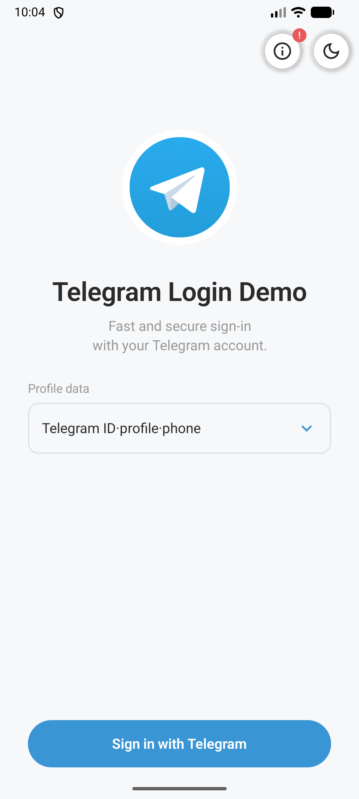
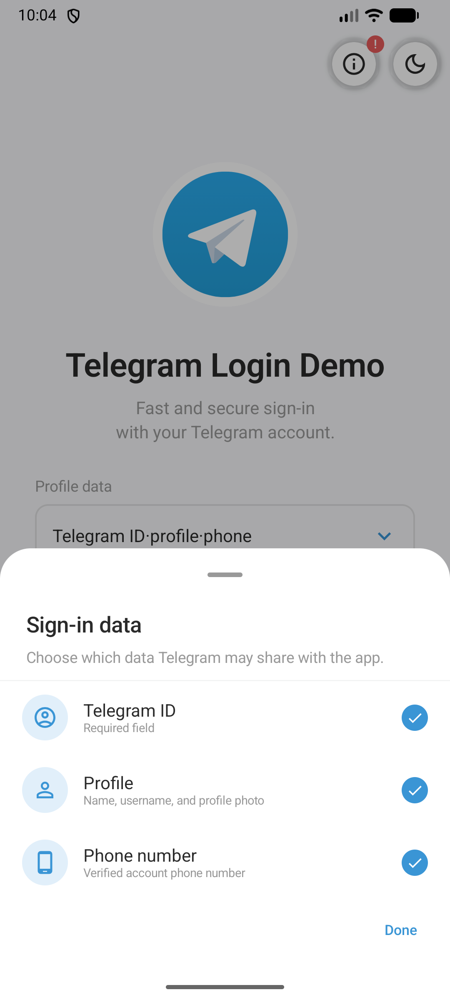
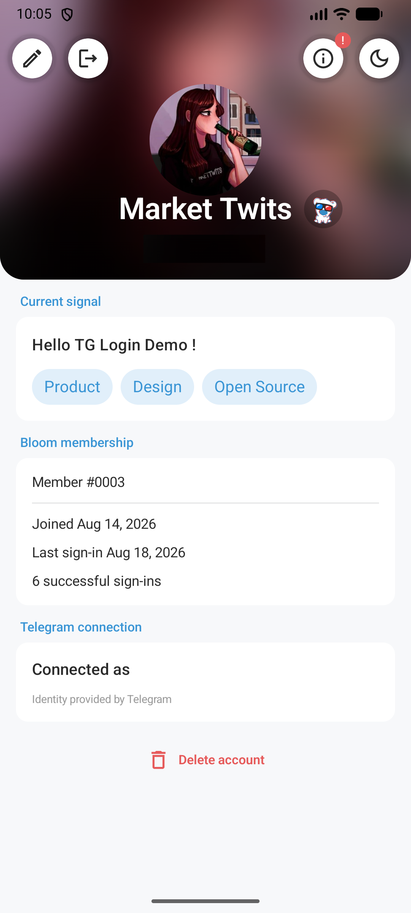
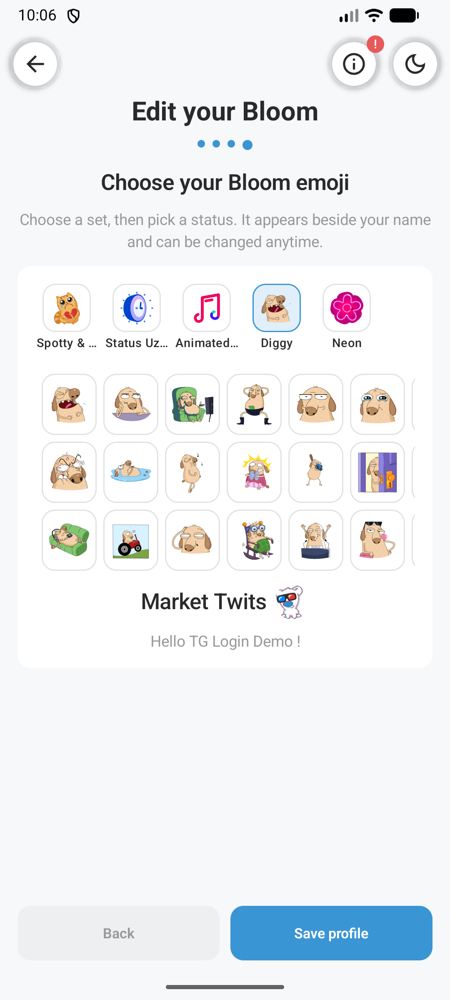
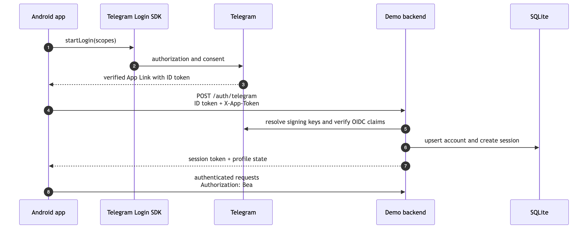

# TelegramLoginAndroidDemo

Android demo for the
[Telegram Login SDK](https://github.com/TelegramMessenger/telegram-login-android).
It demonstrates Telegram authentication through Android App Links, backend ID-token
verification, application sessions, and a small editable profile. The repository contains
the Jetpack Compose client, a Node.js backend, and SQLite storage.

## Screenshots

|             Login              |          Sign-in data          |            Profile             |          Emoji picker          |
|:------------------------------:|:------------------------------:|:------------------------------:|:------------------------------:|
|  |  |  |  |

## Authentication flow



Telegram proves identity; the backend owns the application account, session, profile, and
emoji selection. Tokens and profile data are cached encrypted on Android.

## Local setup

Requirements: Android Studio with JDK 21, Node.js 22.13+ or Docker, and a GitHub token with
`read:packages` access to the SDK.

1. Configure the Android integration in BotFather and obtain its App Link host.
2. Copy [`local.properties.example`](local.properties.example) to `local.properties` and
   fill in the required Android and GitHub Packages values.
3. Copy [`.env.example`](.env.example) to `.env` and fill in the matching backend values.
4. Start the backend and ADB forwarding:

```bash
./scripts/run-backend-local.sh
```

Alternatively, use Docker and configure forwarding manually:

```bash
docker compose up --build -d
adb reverse tcp:8080 tcp:8080
```

Sync Gradle and run the `app` configuration from Android Studio.
