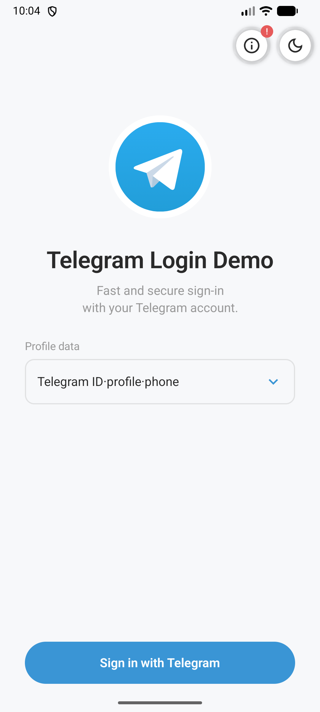
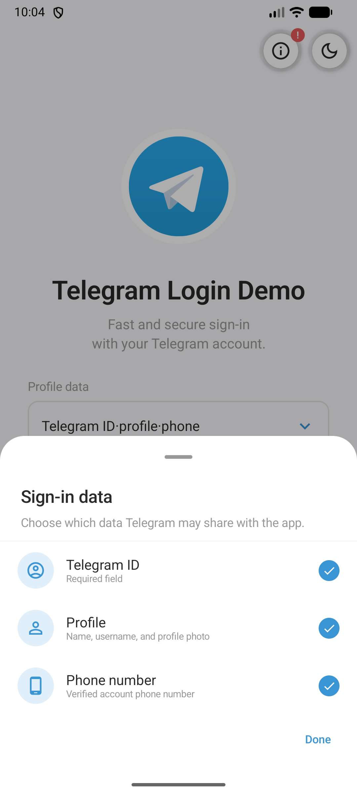
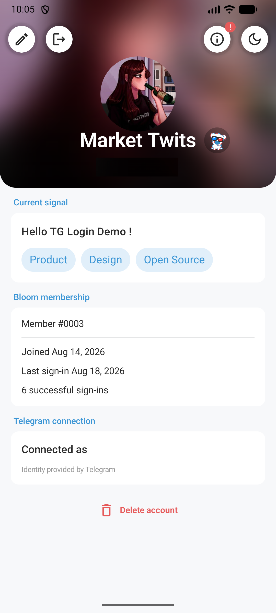
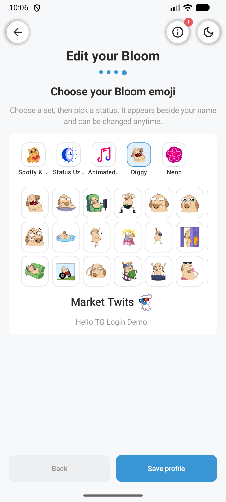
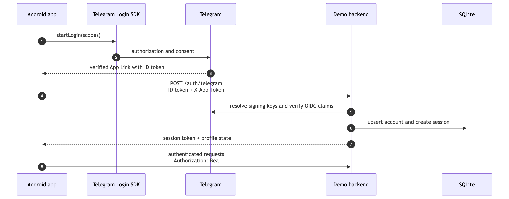

# TelegramLoginAndroidDemo

Android demo for the
[Telegram Login SDK](https://github.com/TelegramMessenger/telegram-login-android).
It demonstrates Telegram authentication through Android App Links, backend ID-token
verification, application sessions, and a small editable profile. The repository contains
the Jetpack Compose client, a Node.js backend, and SQLite storage.

## Screenshots

|             Login              |          Sign-in data          |            Profile             |          Emoji picker          |
|:------------------------------:|:------------------------------:|:------------------------------:|:------------------------------:|
|  |  |  |  |

## Authentication flow



Telegram proves identity; the backend owns the application account, session, profile, and
emoji selection. Tokens and profile data are cached encrypted on Android.

Existing accounts can also register discoverable passkeys from the profile and use them for
subsequent sign-in through Android Credential Manager. Telegram remains the account bootstrap
and recovery method.

## Local setup

Requirements: Android Studio with JDK 21, Node.js 22.13+ or Docker, and a GitHub token with
`read:packages` access to the SDK.

1. Configure the Android integration in BotFather and obtain its App Link host.
2. Copy [`local.properties.example`](local.properties.example) to `local.properties` and
   fill in the required Android and GitHub Packages values.
3. Copy [`.env.example`](.env.example) to `.env` and fill in the matching backend values.
4. Start the backend and ADB forwarding:

```bash
./scripts/run-backend-local.sh
```

Alternatively, use Docker and configure forwarding manually:

```bash
docker compose up --build -d
adb reverse tcp:8080 tcp:8080
```

Sync Gradle and run the `app` configuration from Android Studio.

## Production notes

- `APP_TOKEN` / `APP_TOKENS`: Mandatory when `NODE_ENV=production`. Identifies an approved client
  and limits casual API abuse. To perform zero-downtime rotation, set `APP_TOKENS=new_token,old_token`
  during rollout, release the updated Android client, and safely retire `old_token` once adoption is complete.
  Token comparison is timing-attack safe (`crypto.timingSafeEqual`).
- `/api/health/live` is intentionally public and returns only a minimal process status.
  `/api/health/ready` exposes dependency readiness and requires `X-App-Token`.
- `/` is a static, non-interactive service notice. It does not enumerate routes,
  dependencies, storage, configuration, or operational health.
- Keep TLS termination at the reverse proxy, restrict CORS to known origins if browser
  clients are introduced, and do not publish database files, logs, metrics, or management
  endpoints.
- Passkeys require `PASSKEY_RP_ID`, the allowed Android origin, application package, and signing
  certificate fingerprints from `.env.example`. The backend publishes the matching Digital
  Asset Links document at `/.well-known/assetlinks.json`; the RP ID must resolve to that same
  HTTPS backend host.

## Observability & Logging

- Set `LOG_FORMAT=json` for machine-parseable JSON logs in production (defaults to `json` when `NODE_ENV=production`).
- Sensitive data (bearer tokens, session secrets, WebAuthn challenge/signature payloads, user phone/names)
  are strictly redacted or SHA-256 hashed before logging.
- Passkey audit events log operation type, outcome, credential ID hash, and duration without leaking crypto payloads.

## Operational Scripts

- **Production Passkey Verification:**
  ```bash
  ./scripts/verify-production-passkeys.sh https://your-domain.com
  ```
  Verifies Digital Asset Links, HTTPS headers, package name, fingerprint matching, and readiness without leaking secrets.

- **Production Smoke Check:**
  ```bash
  ./scripts/smoke-check-production.sh https://your-domain.com your-app-token
  ```
  Runs safe read-only queries against `/api/health/live`, `/api/health/ready`, and AssetLinks.

- **SQLite Disaster Recovery:**
  ```bash
  # Create a consistent online backup with SHA-256 checksum and integrity verification:
  ./scripts/backup-sqlite.sh /path/to/app.db /path/to/backups

  # Verify and restore a backup into a target database:
  ./scripts/restore-sqlite.sh /path/to/backups/sqlite-backup-YYYYMMDD-HHMMSS.db /path/to/restored.db
  ```

