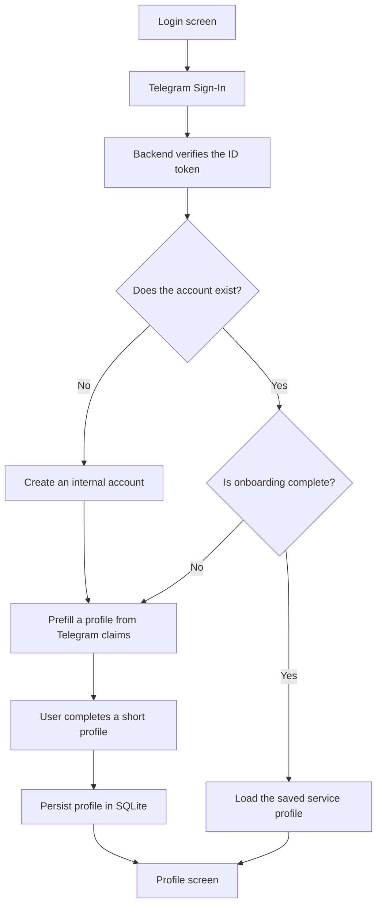

# Telegram Bloom: implementation plan

## 1. Concept

Telegram Bloom is a small community service where a person creates a compact
profile describing what they are building, what they can help with, or what
they are currently exploring.

Telegram answers the question **who signed in**. Telegram Bloom stores **who
that person is inside the service**.

The project remains a focused technology demo, but demonstrates the complete
authentication lifecycle:

- Telegram Sign-In;
- cryptographic ID token verification on the backend;
- creation of an internal service account;
- first-time profile onboarding;
- persistence of an application-owned profile;
- session restoration;
- recognition of returning users;
- local encrypted session and profile cache;
- sign-out and server-side session revocation.

The core product idea is a personal **signal card**:

> Alex Morgan<br>
> Building an Android privacy tool<br>
> Android · Security · Open Source<br>
> Open to collaboration<br>
> Member #0042 · Joined August 2026

## 2. Product principles

1. **Telegram authentication must feel effortless.** The user should not enter
   information Telegram has already provided.
2. **Onboarding must fit on one screen.** This is a demo, not a large social
   network.
3. **Telegram identity and the service profile must remain separate.** A change
   in Telegram must not silently overwrite user-edited profile fields.
4. **Returning users must immediately see their saved service profile.** They
   must not complete onboarding again.
5. **The application always uses the official Telegram Login SDK.** There is no
   simulated authentication provider or credential-free fallback.
6. **Private Telegram claims must not become public profile data implicitly.**
7. **The interface should explain the technology without looking like a debug
   console.** Technical details remain available through the information
   action.

## 3. Main user flow



## 4. First registration

1. The user opens the application.
2. The user selects which optional Telegram claims may be requested.
3. The user presses **Sign in with Telegram**.
4. Telegram completes authorization.
5. The application receives the callback.
6. The Android application sends the ID token to the backend.
7. The backend verifies signature, issuer, audience, expiration, and algorithm.
8. The backend searches for an account by the stable Telegram `sub` claim.
9. No account is found, so the backend creates an internal account with the
   `PROFILE_REQUIRED` onboarding state.
10. The backend creates an application session.
11. Android securely caches the session and account state.
12. The application opens the profile setup screen.
13. Available Telegram claims prefill the form.
14. The user adds one short personal description and selects up to three
    interests.
15. The user presses **Create my profile**.
16. The backend validates and persists the profile.
17. The onboarding state becomes `PROFILE_COMPLETED`.
18. The application opens the completed profile screen.

The profile setup must remain a single compact screen. No email, password,
confirmation code, multi-step wizard, or repeated personal information entry is
required.

## 5. Returning user flow

1. Telegram verifies the person again.
2. The backend finds the existing account by Telegram `sub`.
3. The backend updates only external identity metadata:
   - Telegram username;
   - Telegram name claims;
   - Telegram avatar URL;
   - phone verification state;
   - Telegram synchronization timestamp.
4. The backend does not overwrite the application-owned profile.
5. It updates `lastLoginAt` and `loginCount`.
6. It issues a new application session.
7. It returns the existing service account and profile.
8. Android navigates directly to the profile screen.

An optional Telegram-style snackbar can say:

> Welcome back, Alex. Your profile is exactly where you left it.

## 6. Identity and profile separation

### 6.1 Telegram identity

Telegram identity contains externally verified data:

- stable Telegram `sub`;
- Telegram username;
- name;
- given name;
- family name;
- avatar URL;
- phone number when requested;
- phone verification status;
- time of the last synchronization.

Only `sub` is used to identify an account. Telegram username must never be used
as the account key because it can change or disappear.

### 6.2 Service account

The internal account contains system-owned information:

- internal UUID;
- member number;
- registration date;
- last successful sign-in;
- successful sign-in count;
- onboarding state;
- account status.

### 6.3 Service profile

The service profile contains user-editable public information:

- display name;
- short headline;
- current intent;
- up to three topics;
- avatar source;
- stable visual seed;
- creation and update timestamps.

Changing a Telegram name must not change the saved display name. Telegram data
is used as a suggestion during initial onboarding, not as permanent ownership
of the service profile fields.

## 7. Profile setup screen

### 7.1 Header

Title:

> Create your Bloom

Subtitle:

> Telegram has verified your identity. Add one personal touch to complete your
> profile.

### 7.2 Avatar source

The screen initially shows the Telegram avatar or initials. The user may choose:

- **Telegram photo** — use the latest Telegram avatar when available;
- **My Bloom** — use a stable generated service identity.

This choice visually demonstrates the separation between the external identity
provider and the internal application profile.

### 7.3 Display name

The display name is prefilled in this order:

1. Telegram `name`;
2. `given_name + family_name`;
3. Telegram username;
4. `Telegram user`;
5. initials or internal member number.

The field is editable and remains owned by the service after profile creation.

### 7.4 Intent

The user selects exactly one intent:

- `BUILDING` — Building something;
- `HELPING` — Can help;
- `EXPLORING` — Exploring ideas.

The selection should use three compact selectable cards or chips rather than a
large dropdown.

The selected intent changes the prompt for the headline:

- `BUILDING`: **What are you building?**
- `HELPING`: **What can you help with?**
- `EXPLORING`: **What are you exploring?**

### 7.5 Headline

The headline is a short one- or two-line field with an 80–120 character limit.

Example:

> Building a privacy-first Android application

A character counter appears only when the user approaches the limit.

### 7.6 Topics

The user selects between one and three topics:

- Android;
- Backend;
- Design;
- Security;
- Open Source;
- AI;
- Product;
- Telegram;
- Other.

The demo does not need an unlimited tag catalog or custom tag management.

### 7.7 Telegram identity summary

A small read-only section shows:

```text
Connected as @alex_morgan
Phone verified
Identity provided by Telegram
```

The complete phone number must not become public profile information. When the
phone scope is granted, the profile displays only a verification signal.

### 7.8 Completion action

The primary action is **Create my profile**.

It becomes enabled when:

- display name is not blank;
- one intent is selected;
- headline is valid;
- at least one topic is selected.

## 8. Completed profile screen

The screen retains the existing Telegram-inspired collapsible profile header.

### 8.1 Compact header

- avatar or Bloom;
- display name;
- Telegram username when available;
- short status;
- application actions.

### 8.2 Expanded header

- blurred Telegram avatar or Bloom gradient background;
- large avatar;
- display name;
- selected intent;
- smooth scroll-based collapse;
- snapping to stable compact or expanded states;
- haptic feedback when crossing the final state boundary.

### 8.3 Current signal

The main profile card contains:

```text
Building something

Building a privacy-first Android application
```

### 8.4 Topics

Topics are displayed as compact Telegram-style chips:

```text
Android    Security    Open Source
```

### 8.5 Membership information

The service-owned section contains:

```text
Member #0042
Joined August 8, 2026
Last sign-in today
3 successful sign-ins
```

This block makes it clear that the user has an account in the service rather
than merely viewing claims returned by Telegram.

### 8.6 Telegram connection

A compact row shows:

```text
Telegram connected · @alex_morgan
```

Its menu may contain:

- Copy username;
- Copy Telegram ID in explicit demo/debug contexts;
- View authentication details.

### 8.7 Actions

The top application bar retains:

- profile editing;
- configuration information;
- theme switching;
- sign-out with confirmation.

Signing out revokes and removes the session but preserves the service account
and profile.

## 9. Personal Bloom visual

Every internal account receives a random `visualSeed` once during registration.
The seed is stored by the backend and generates a stable lightweight visual in
Compose.

The seed determines:

- two or three colors;
- petal count;
- inner circle positions;
- rotation;
- center shape.

Requirements:

- the same seed always creates the same Bloom;
- rendering requires no image generation service or file storage;
- it works in light, dark, automatic, and expressive themes;
- it can replace a missing Telegram avatar;
- it may be reused as a header background and small profile badge;
- it must not be derived directly from Telegram ID.

The Bloom is deliberately decorative. It must not become another identity or
authentication mechanism.

## 10. Telegram scope behavior

The selected scopes must affect onboarding and returned data.

### 10.1 Base OpenID only

- internal account ID is available;
- display name requires manual input;
- generated Bloom or initials are used.

### 10.2 Profile scope

The application can prefill:

- name;
- username;
- avatar;
- initials.

### 10.3 Phone scope

The complete phone number remains private. The public service profile may show
only:

```text
Phone verified by Telegram
```

If a scope was not granted, its data must not appear in the UI, backend
response, or service profile.

## 11. Backend data model

### 11.1 Users table

Extend the account storage with:

```text
id
telegram_subject
telegram_username
telegram_name
telegram_given_name
telegram_family_name
telegram_phone_number
telegram_phone_verified
telegram_picture_url
onboarding_state
member_number
login_count
created_at
last_login_at
telegram_synced_at
```

`member_number` can be a sequential number used only for a friendly
`Member #0042` representation.

### 11.2 Profiles table

```text
id
user_id
display_name
headline
intent
topics_json
avatar_source
visual_seed
created_at
updated_at
```

The `users` to `profiles` relationship is one-to-one. A JSON array is sufficient
for topics in this demo; a normalized topic relation would add unnecessary
complexity.

### 11.3 Onboarding state

Supported states:

```text
PROFILE_REQUIRED
PROFILE_COMPLETED
DISABLED
```

`DISABLED` reserves a clear state for future account deletion or suspension,
even if no dedicated UI is implemented initially.

## 12. Backend API

### 12.1 Telegram authentication

```http
POST /auth/telegram
```

Request:

```json
{
  "idToken": "eyJ..."
}
```

New account response:

```json
{
  "sessionToken": "application-session-token",
  "expiresAt": "2026-09-08T10:00:00Z",
  "account": {
    "id": "internal-user-id",
    "memberNumber": 42,
    "onboardingState": "PROFILE_REQUIRED",
    "registeredAt": "2026-08-08T10:00:00Z",
    "loginCount": 1
  },
  "telegram": {
    "name": "Alex Morgan",
    "username": "alex_morgan",
    "picture": "https://example.com/avatar.jpg",
    "phoneVerified": true
  },
  "profile": null
}
```

Returning account response:

```json
{
  "sessionToken": "application-session-token",
  "expiresAt": "2026-09-12T08:30:00Z",
  "account": {
    "id": "internal-user-id",
    "memberNumber": 42,
    "onboardingState": "PROFILE_COMPLETED",
    "registeredAt": "2026-08-08T10:00:00Z",
    "lastLoginAt": "2026-08-12T08:30:00Z",
    "loginCount": 3
  },
  "telegram": {
    "username": "alex_morgan",
    "phoneVerified": true
  },
  "profile": {
    "displayName": "Alex",
    "headline": "Building a privacy-first Android application",
    "intent": "BUILDING",
    "topics": ["ANDROID", "SECURITY", "OPEN_SOURCE"],
    "avatarSource": "TELEGRAM",
    "visualSeed": "stable-service-seed"
  }
}
```

### 12.2 Restore current session

```http
GET /auth/session
```

The existing endpoint should return:

- session expiration;
- account;
- onboarding state;
- Telegram identity summary;
- profile when available.

This endpoint is the source of truth when restoring the application after a
process restart.

### 12.3 Create or update profile

```http
PUT /me/profile
```

Request:

```json
{
  "displayName": "Alex",
  "headline": "Building a privacy-first Android application",
  "intent": "BUILDING",
  "topics": ["ANDROID", "SECURITY", "OPEN_SOURCE"],
  "avatarSource": "TELEGRAM"
}
```

The backend must:

1. validate the session;
2. validate field length and enum values;
3. create or update the profile idempotently;
4. set onboarding to `PROFILE_COMPLETED`;
5. return the persisted profile.

`PUT` is preferred because retrying the same request after a transient network
error is safe.

### 12.4 Sign-out

```http
DELETE /auth/session
```

The session is revoked, while the account and profile remain in SQLite.

## 13. Android architecture

The implementation follows the existing project preference: models,
datasources, and repositories without a separate domain/use-case layer.

### 13.1 Models

Add:

```text
ServiceAccount
ServiceProfile
ProfileDraft
OnboardingState
ProfileIntent
ProfileTopic
AvatarSource
AuthenticationResult
```

### 13.2 Remote datasource

The backend datasource provides:

```text
authenticate(idToken)
getCurrentSession(accessToken)
saveProfile(accessToken, profileDraft)
revokeSession(accessToken)
```

### 13.3 Local datasource

The encrypted local datasource caches:

- session token;
- service account;
- service profile;
- onboarding state;
- incomplete profile draft.

The session token remains encrypted. Profile data may use the same encrypted
storage to keep the demo architecture uniform.

### 13.4 Repository

`AuthenticationRepository` coordinates:

- Telegram Sign-In;
- backend authentication;
- session persistence;
- account restoration;
- profile creation and update;
- sign-out.

A separate `ProfileRepository` is unnecessary unless profile management grows
into a larger independent feature.

## 14. Application startup and navigation

The application must not briefly show the login screen while restoring a saved
account.

Root application state:

```text
Loading
Unauthenticated
OnboardingRequired
Authenticated
RecoverableError
```

Startup flow:

1. Read the locally cached session.
2. If no session exists, show Login.
3. If a cached completed profile exists, render it immediately.
4. Validate the session through `GET /auth/session` in the background.
5. Refresh the local cache when validation succeeds.
6. If the session has expired, clear it and show Login with a snackbar.
7. If onboarding is incomplete, open Profile Setup.
8. If the network is unavailable but a cached profile exists, keep it visible
   with a subtle offline indication.

## 15. Interrupted onboarding

If the user completes Telegram authentication but closes the application before
saving the profile:

- the internal account already exists;
- the application session remains cached;
- the backend keeps `PROFILE_REQUIRED`;
- the local profile draft is preserved;
- the next launch opens Profile Setup;
- another Telegram login returns the same internal account;
- no duplicate account is created.

Saving the profile must be idempotent so an interrupted response can be retried
without creating duplicates.

## 16. Error handling

User-facing messages:

- No network: **Could not connect. Check your internet connection and try
  again.**
- Backend unavailable: **The service is temporarily unavailable.**
- Telegram rejected authentication: **Telegram could not confirm the sign-in.**
- Session expired: **Your session has ended. Sign in again.**
- Profile save failed: **Could not save the profile. Your changes are still
  here.**
- Invalid field: show a short inline validation message.

Technical exception strings must never be shown directly. Network, HTTP,
configuration, serialization, validation, session, and Telegram SDK errors
remain separate typed failures and are mapped to localized messages in the UI
layer.

## 17. Required integration configuration

Before Gradle Sync, the project requires:

- GitHub Packages username and token for resolving the official Telegram Login
  SDK;
- Telegram Client ID;
- Telegram redirect host;
- backend URL.

The application must fail configuration early when any value is missing. It
must never replace Telegram authentication with a simulated callback or local
identity. Backend and Android integration tests may use test doubles, but those
doubles must not be packaged in the application.

## 18. Explicit non-goals

To preserve simplicity, the first version does not include:

- a directory of other users;
- chats;
- follows or subscriptions;
- file uploads;
- passwords;
- email authentication;
- roles and permissions;
- push notifications;
- an administration panel;
- an unlimited topic catalog;
- public profile URLs;
- contact synchronization;
- multiple Telegram accounts;
- automatic overwriting of service profile fields from Telegram.

One identity, one service account, one session, and one polished personal card
are sufficient for the demo.

## 19. Implementation phases

### Phase 1: backend account state

- extend the SQLite schema;
- add the profiles table;
- add onboarding state;
- add member number;
- add login count and last login time;
- make migration idempotent;
- extend the Telegram authentication response;
- test new and returning account behavior.

### Phase 2: profile API

- implement `PUT /me/profile`;
- add authentication and validation;
- extend `GET /auth/session`;
- return typed public errors;
- test idempotent profile creation and update;
- test interrupted onboarding recovery.

### Phase 3: Android models and datasources

- add account and profile models;
- expand the real remote datasource;
- update local encrypted storage;
- preserve the single mandatory Telegram SDK implementation;
- add repository tests.

### Phase 4: root navigation state

- introduce bootstrap loading state;
- remove login screen flashing;
- route a new user to Profile Setup;
- route a returning user directly to Profile;
- restore incomplete onboarding;
- support cached offline profile rendering.

### Phase 5: Profile Setup UI

- implement the single-screen onboarding;
- prefill Telegram claims;
- add intent selection;
- add topic selection;
- add avatar source selection;
- preserve draft input;
- add progress, retry, and snackbar behavior;
- verify keyboard and system inset handling.

### Phase 6: completed Profile UI

- replace the raw Telegram claims view with the service profile;
- preserve the collapsible Telegram-style header;
- add Current Signal;
- add topics;
- add membership information;
- add Telegram connection information;
- add profile editing;
- preserve theme, configuration, and sign-out actions.

### Phase 7: Bloom visual

- define the deterministic seed format;
- implement Compose rendering;
- support all application themes;
- use it as an avatar fallback;
- integrate it into the collapsible header;
- add screenshot tests for stable seeds.

### Phase 8: stabilization

- offline cache behavior;
- expired session handling;
- interrupted onboarding;
- backend retry behavior;
- accessibility semantics;
- English and Russian localization;
- emulator end-to-end tests;
- backend integration tests;
- Docker Compose verification;
- README and API documentation.

## 20. Test matrix

### Backend

- first Telegram login creates one account;
- repeated login with the same `sub` returns the same account;
- changed Telegram username does not create a new account;
- changed Telegram name does not overwrite the service profile;
- profile creation changes onboarding state;
- repeated identical `PUT /me/profile` is safe;
- expired session cannot read or edit the profile;
- sign-out revokes only the session;
- account and profile survive backend restart;
- missing optional Telegram claims produce valid responses;
- private phone data does not leak into public profile output.

### Android

- clean install opens Login;
- successful first login opens Profile Setup;
- fields are prefilled only when claims are available;
- invalid profile input cannot be submitted;
- successful submission opens Profile;
- process restart does not flash Login;
- cached profile renders before network validation;
- expired session returns to Login with a clear message;
- interrupted onboarding restores the draft;
- returning authentication skips onboarding;
- sign-out confirmation revokes and clears the session;
- subsequent login restores the same profile;
- missing SDK or Telegram configuration fails before application build.

## 21. Definition of done

The feature is complete when this end-to-end scenario succeeds:

1. Start from a clean installation.
2. Sign in through Telegram.
3. Verify the Telegram identity on the backend.
4. Create exactly one internal service account.
5. Open one short prefilled onboarding screen.
6. Add a headline and topics.
7. Save a personal service profile.
8. Display the completed profile and membership information.
9. Restart the application without displaying Login first.
10. Restore the profile from local cache and validate the session.
11. Sign out and revoke the server session.
12. Sign in again through Telegram.
13. Find the same account by Telegram `sub`.
14. Skip onboarding.
15. Return the unchanged service profile.
16. Clearly demonstrate that Telegram authenticated the user while the service
    owns and persists the resulting profile.

The final product should feel like a small complete application rather than a
collection of Telegram claims, while keeping the registration experience close
to a single action and one short profile confirmation screen.
